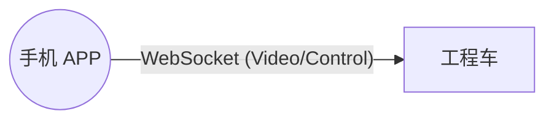
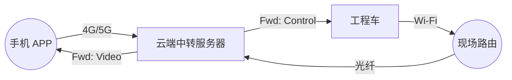
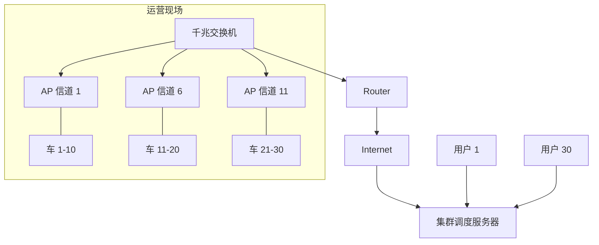

# 项目主控文档：ESP32-CAM 视觉遥控工程车 (全流程版)

## 1. 项目总目标 (Project Goal)
构建一套**可远程运营的工程车集群系统**。从单车原型开始，最终实现 30 台车辆的远程云端调度与控制。
*   **阶段一 (原型)**：单车、局域网直连、验证机械结构与基础代码。
*   **阶段二 (云控)**：搭建中转服务器，实现 4G/5G 远程控制。
*   **阶段三 (集群)**：30台车同场运行，解决网络干扰与带宽瓶颈。

## 2. 硬件采购清单 (Beginner BOM - 单车份)
**注意：做大规模集群前，必须先用这套配置跑通单车。**

| 部件名称 | 规格/型号备注 | 推荐理由 |
| :--- | :--- | :--- |
| **主控板** | **ESP32-CAM (带 MB 底板套装)** | 核心大脑。批量部署时可只买核心板，研发必须带底板。 |
| **电机驱动** | **L298N 驱动模块 (红色)** | 驱动履带的主力。 |
| **电源** | **18650 电池 x2 (串联盒)** | 提供强劲动力。 |
| **降压模块** | **LM2596S DC-DC** | 稳压 5V 供电，保证不掉线。 |
| **车体** | **汇纳 550 挖掘机** | 适合改装。 |

## 3. 系统架构演进 (Architecture Evolution)

### 阶段一：局域网直连 (LAN P2P)
*手机直接连车的 Wi-Fi，或两者连同一个路由。低延迟，适合调试。*

### 阶段二：云端中转 (Cloud Relay)
*手机和车只认识服务器。只要有网，全球可控。*

### 阶段三：集群部署 (Fleet 30 Units)
*解决拥堵问题。核心是【信道隔离】和【带宽管理】。*

## 4. 实施步骤规划 (Roadmap)

### 第一阶段：单车原型 (当前关注点)
*   **目标**：跑通 硬件连接 -> 固件烧录 -> APP 控制 闭环。
*   **任务**：
    1.  采购硬件。
    2.  编写 ESP32 单机固件 (CameraWebServer)。
    3.  编写 Flutter 单机 APP。

### 第二阶段：远程云服务器搭建 (后续目标)
*   **目标**：脱离局域网，实现异地控制。
*   **任务**：
    1.  购买/配置云服务器 (阿里云/腾讯云)。
    2.  用 Node.js 编写 WebSocket Relay 服务 (中转站)。
    3.  改造 ESP32 固件：从 "做服务器" 变为 "做客户端"。

### 第三阶段：压力测试与集群 (终极目标)
*   **目标**：30台车稳定运行。
*   **任务**：
    1.  **宽带压测**：模拟 30 路视频上传 (需 60Mbps 上行带宽)。
    2.  **信道规划**：现场部署 3 个 AP，严格划分频段。
    3.  **后台管理**：开发 Web 页面监控哪台车在线、电量如何。

## 5. 用户下一步行动
请确认 **`task.md`** 中的流程符合您的预期。
如果没有问题，我们依然从 **采购硬件** 和 **第一阶段代码** 开始，因为后两阶段的代码都是基于第一阶段修改而来的。
