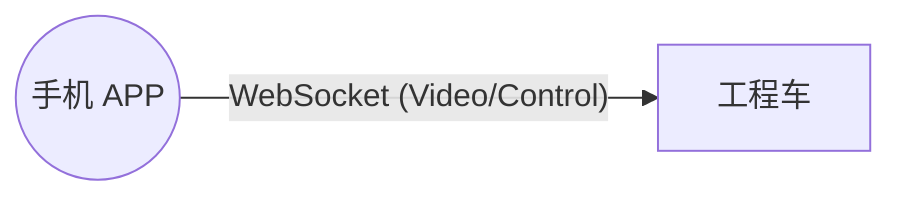
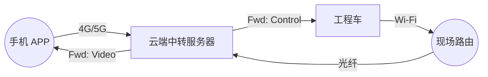
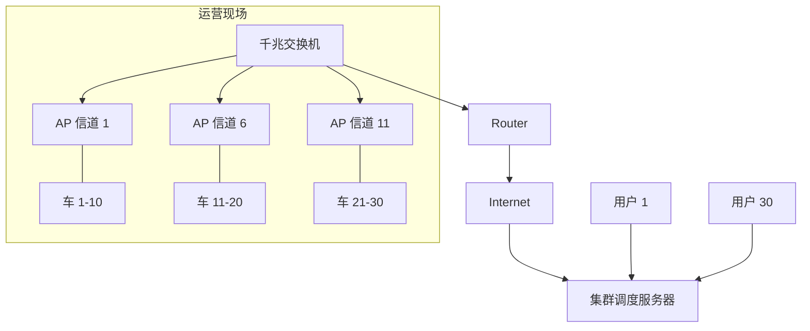

# 项目主控文档：ESP32-CAM 视觉遥控工程车 (全流程版)

## 1. 项目总目标 (Project Goal)
构建一套**可远程运营的工程车集群系统**。从单车原型开始，最终实现 30 台车辆的远程云端调度与控制。
*   **阶段一 (原型)**：单车、局域网直连、验证机械结构与基础代码。
*   **阶段二 (云控)**：搭建中转服务器，实现 4G/5G 远程控制。
*   **阶段三 (集群)**：30台车同场运行，解决网络干扰与带宽瓶颈。

## 2. 硬件采购清单 (精准型号版)
*本清单经过严格筛选，完全适配“阶段一：单车原型”及后续扩展。请按“具体型号”精准采购。*

### 2.1 核心硬件 (Single Vehicle Core)
| 部件名称 | 具体型号/规格 | 详细参数 | 推荐理由 | 参考单价 | 注意事项 |
| :--- | :--- | :--- | :--- | :--- | :--- |
| **主控板** | **ESP32-CAM 开发板 (带 MB 底板套装)** | 主控：ESP32-WROOM-32；摄像头：OV2640 (200W)；带USB转串口底板 | **核心大脑**。MB底板解决烧录难、供电不稳问题，研发必备。 | 55-60元 | **必须买“套装”** (含核心板+MB底板+天线)，否则无法烧录。 |
| **电机驱动** | **L298N 驱动模块 (红色款)** | 输入12V，2A电流，带散热片 | **动力心脏**。经典红板，带散热片适合长时间工作。 | 15-20元 | 确认是**“红色外壳+散热片”**款，不要买迷你版。 |
| **电源** | **18650 锂电池 x2 + 串联盒** | 2000mAh，串联后 7.4V，**带保护板** | **强劲动力**。2节串联能提供充沛电压给电机。 | 30-35元 | 必须买**带保护板的串联盒**，防止电池过放损坏。 |
| **降压模块** | **LM2596S DC-DC (带数显)** | 输入4-40V，输出1.25-35V (需调至5V) | **稳压器**。精准给 ESP32 供电，防止电压波动导致死机。 | 12-15元 | 购买时备注“**默认输出5V**”，没经验的建议买**数显款**。 |
| **充电器** | **18650 专用双槽充电器** | 带过充保护 (红充绿满) | 必备。通用充电器不可用。 | 20-25元 | 认准**“18650专用”**。 |
| **数据线** | **Micro-USB 数据线** | **支持数据传输** (纯铜) | 必备。用于烧录代码。 | 10-15元 | **必须能传数据**！很多线只能充电，买前问客服。 |

### 2.2 必备工具与辅材 (Tools & Consumables)
| 名称 | 规格建议 | 用途 | 参考单价 | 备注 |
| :--- | :--- | :--- | :--- | :--- |
| **小号螺丝刀** | PH00 十字 (带磁性) | 拆卸玩具车 | 8-12元 | 带磁性最好。 |
| **电烙铁套装** | 60W 恒温 + 焊锡丝 | 连接电机线 | 35-45元 | 新手买恒温款。不想焊就买**免焊线扣**。 |
| **免焊线扣** | 2.54mm (杜邦线专用) | 替代焊接 | 5-8元 | 如果没烙铁，这个是神器。 |
| **杜邦线** | 公对公、公对母、母对母 | 连接电路 | 5-10元 |各买一排备用。 |
| **绝缘胶带/热缩管**| PVC / 混合装 | 包裹接头 | 10-15元 | 防止短路烧板子。 |
| **热熔胶枪** | 20W 迷你款 + 胶棒 | 固定电路板 | 15-20元 | 透明胶棒即可。 |
| **万用表** | DT9205A (可选) | 查错/测电压 | 30-40元 | 排除故障神器，推荐买。 |

## 3. 系统架构演进 (Architecture Evolution)

### 阶段一：局域网直连 (LAN P2P)
*手机直接连车的 Wi-Fi，或两者连同一个路由。低延迟，适合调试。*

### 阶段二：云端中转 (Cloud Relay)
*手机和车只认识服务器。只要有网，全球可控。*

### 阶段三：集群部署 (Fleet 30 Units)
*解决拥堵问题。核心是【信道隔离】和【带宽管理】。*

## 4. 实施步骤规划 (Roadmap)

### 第一阶段：单车原型 (当前关注点)
*   **目标**：跑通 硬件连接 -> 固件烧录 -> APP 控制 闭环。
*   **任务**：
    1.  采购硬件。
    2.  编写 ESP32 单机固件 (CameraWebServer)。
    3.  编写 Flutter 单机 APP。

### 第二阶段：远程云服务器搭建 (后续目标)
*   **目标**：脱离局域网，实现异地控制。
*   **任务**：
    1.  购买/配置云服务器 (阿里云/腾讯云)。
    2.  用 Node.js 编写 WebSocket Relay 服务 (中转站)。
    3.  改造 ESP32 固件：从 "做服务器" 变为 "做客户端"。

### 第三阶段：压力测试与集群 (终极目标)
*   **目标**：30台车稳定运行。
*   **任务**：
    1.  **宽带压测**：模拟 30 路视频上传 (需 60Mbps 上行带宽)。
    2.  **信道规划**：现场部署 3 个 AP，严格划分频段。
    3.  **后台管理**：开发 Web 页面监控哪台车在线、电量如何。

## 5. 用户下一步行动
请确认 **`task.md`** 中的流程符合您的预期。
如果没有问题，我们依然从 **采购硬件** 和 **第一阶段代码** 开始，因为后两阶段的代码都是基于第一阶段修改而来的。
