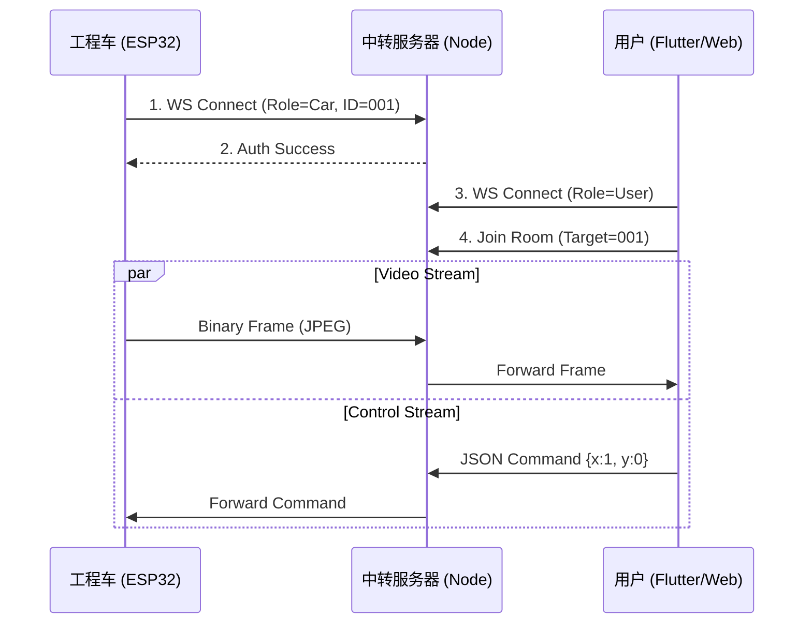

# 01_系统设计说明书 (System Design Spec)
> **Role**: Master Architect
> **Status**: Draft (Waiting for Review)
> **Target**: Cloud Relay Server & Fleet Management Dashboard

## 1. 系统概述
本系统用于实现工程车的远程互联网控制及多车集群调度。
*   **核心功能**：低延迟视频转发、控制指令透传、车辆状态监控。
*   **性能要求**：视频转发延迟 < 200ms。

## 2. 技术栈架构 (Tech Stack)
*   **后端 (Relay Server)**:
    *   **Runtime**: Node.js (TypeScript)
    *   **Protocol**: WebSocket (`ws` library) for real-time video/control.
    *   **DB**: Redis (用于存储车辆在线状态、心跳、临时Session). **不使用 MySQL** 以保证极速读写。
*   **前端 (Web Dashboard)**:
    *   **Framework**: Vue 3 + Vite + Element Plus.
    *   **Video Player**: JSMpeg (用于播放 WebSocket MJPEG 流).
*   **移动端 (Control App)**:
    *   **Framework**: Flutter (已定).

## 3. 模块划分 (Worker Tasks)

### 模块 A: WebSocket 中转核心 (Backend Worker)
*   **任务**: 建立 WebSocket Server，处理 `Vehicle` 和 `User` 的连接。
*   **难点**: 实现“房间”概念，User 加入 Vehicle 的房间后，Pipelines 数据。

### 模块 B: 状态管理服务 (Backend Worker)
*   **任务**: 维护 Redis 中的车辆列表 (`car_list`)。
*   **逻辑**: 车上线写 Redis，断线删 Redis，心跳保活 (3s一次)。

### 模块 C: 运营管理后台 (Frontend Worker)
*   **任务**: 编写 Vue 页面。
*   **页面 1 (大屏)**: 表格展示所有车辆 (ID, IP, 延迟, 状态)。
*   **页面 2 (监视)**: 点击某台车，弹窗显示其实时画面 (只看不控)。

## 4. 数据流向图

